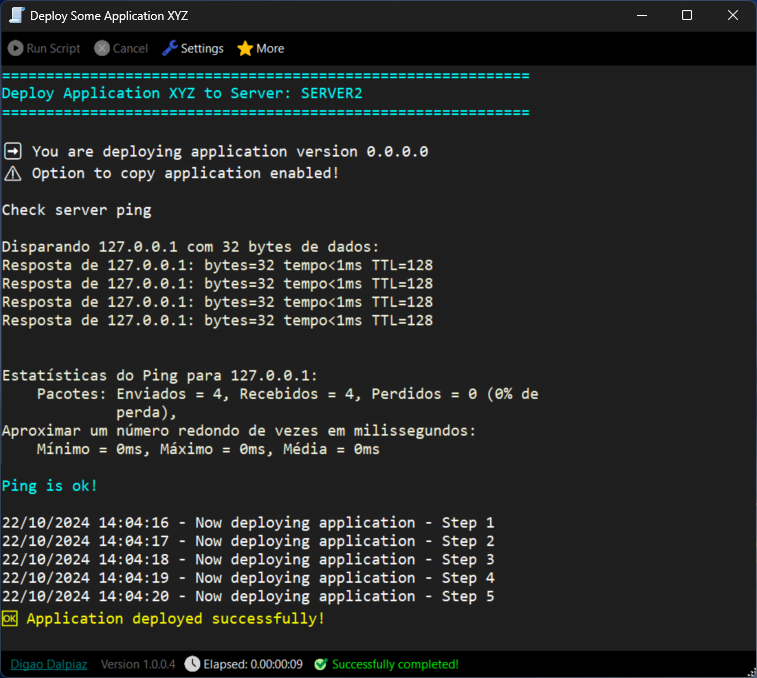
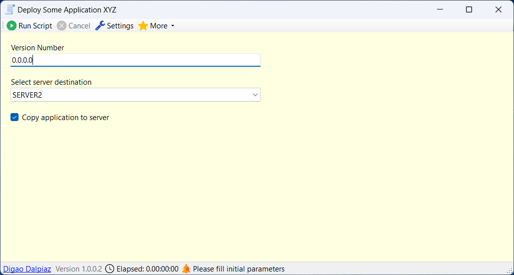

# DigaoRunner

## Run scripts locally and remotely

*Note: the functionality to execute scripts remotely is not yet available.*



In my work environment, I frequently need to create scripts to automate processes. Whether it's to copy files from one place to another for deploying an application or even for more complex tasks involving multiple steps, such as installing services, configuring Windows settings, reading files and extracting information, or any other activity that can be automated.

These are typically tasks where it's not worth writing a specific program. In such cases, we usually resort to a **Batch script (.BAT or .CMD)** or the more modern **PowerShell**.

But let's be honest, for any of these scripts, the language is not very practical, and the script ends up being hard to read and understand, and it's not efficient. For example, error handling in these scripts is cumbersome, and typically, the processes continue even if an error occurs in the middle of the script.

With all this in mind, I developed Digao Runner, which is essentially a debugger for scripts with the **.ds (Digao Script)** extension, where you can write the script using **C# code** in a very practical and easy way. The code is very clean, has **exception handling**, and you can also configure **input fields** for the user to fill in at runtime, like parameters or variables of the script.

Here is an example of a Digao Runner script, used specifically to create the package for the program itself:

```csharp
@DIGAOSCRIPT
VERSION=1
TITLE=Create Digao Runner Package

@CODE
Echo("========================================================", Color.Cyan);
Echo("Generate Digao Runner zip package", Color.Cyan);
Echo("========================================================", Color.Cyan);

int ret;

string vsWhere = @"C:\Program Files (x86)\Microsoft Visual Studio\Installer\vswhere.exe";
string sevenZip = @"C:\Program Files\7-zip\7z.exe";
string pathProject = @".\DigaoRunnerApp\DigaoRunnerApp.csproj";
string tmpBuildDir = @".\Temp_Build";
string packageFile = @".\DigaoRunner.zip";

string vsPath;
ret = RunProcessReadOutput(vsWhere, "/latest /property installationPath", ref vsPath);
if (ret != 0) Abort("Error getting Visual Studio installation path");

vsPath = vsPath.Split(Environment.NewLine).FirstOrDefault();
if (string.IsNullOrEmpty(vsPath)) Abort("Visual Studio path empty");

string msBuildExe = Path.Combine(vsPath, @"MSBuild\Current\bin\msbuild.exe");

if (Directory.Exists(tmpBuildDir)) Directory.Delete(tmpBuildDir, true);
if (File.Exists(packageFile)) File.Delete(packageFile);

Echo("Compile project");
ret = RunProcess(msBuildExe, 
	$"\"{pathProject}\" /clp:ErrorsOnly /t:Rebuild /p:PlatformTarget=x64 /p:Configuration=Release /p:OutputPath=\"{Path.GetFullPath(tmpBuildDir)}\"");
//using GetFullPath because MSBUILD internally uses current path as project folder path
	
if (ret != 0) Abort("Error compiling project");

Echo("Create zip file");
//RunProcess(sevenZip, $"a -sfx DigaoRunnerSetup.exe \"{tmpBuildDir}\"");
ZipFile.CreateFromDirectory(tmpBuildDir, packageFile);

Directory.Delete(tmpBuildDir, true);

Echo("Package successfully created!", Color.Yellow);

```

# Installation

1. Download and install [.NET 8 Desktop Runtime x64](https://dotnet.microsoft.com/en-us/download/dotnet/8.0)

2. Download last Digao Runner release (.zip) from [here](https://github.com/digao-dalpiaz/DigaoRunner/releases/latest)

3. Extract zip to a folder in your computer (Example: C:\DigaoRunner)

4. You may open DigaoRunnerApp.exe and go to menu "More" > "Register .ds files", so the scripts will automatically run with this program.

You are set. Enjoy!

# Script file structure

To create scripts, use the following structure in the file with the .ds extension:

```csharp
@DIGAOSCRIPT

VAR1=value
VAR2=value
VAR3=value

$FIELD1={...}
$FIELD2={...}
$FIELD3={...}

@CODE
Your code here in C# format
```

## Header section

The header section is the part after `@DIGAOSCRIPT` identifier, and before `@CODE` section. In this part, you can specify variable and fields.

### Header Variables

- `VERSION=1` (required)
- `TITLE=Your script title` (optional) it will appear in the window title
- `ADMIN=true` (optional) if specified, it will request Administrator elevation when running the script
- `$MY_FIELD={...}` (optional) it will show the field input when running script, before executing code section

**If any field is specified (using prefix `$`), then when the script is run, the user will first be prompted to fill in the fields.**

Comments are allowed in header section using `//` prefix

### Header Fields

The fields have the following structure in JSON format:

`$MY_FIELD={"Label": "Field Description", "Type": "...", "Default": ..., "Items": [], Editable: true}`

`Type` property values:
- "text" (TextBox)
- "check" (CheckBox)
- "combo" (ComboBox)

`Default` property is optional and must be according to the `Type`. Example: When `Type` = `text`, default value must be string (`"default value"`). When `Type` = `check`, default value must be boolean (`true` or `false`).

`Items` property is a string array and should be specified when `Type` = `combo`. Example: `["VALUE1", "VALUE2", "VALUE3"]`.

`Editable` property is optional and allows configure an editable Combo Box.



## Code Tricks

The following imports are internally specified:
- System
- System.Text
- System.Linq
- System.IO
- System.IO.Compression
- System.Diagnostics
- System.Drawing
- System.Text.RegularExpressions
- Microsoft.Win32

So, you may use classes from these imports directly. Example: `StringBuilder` (comes from System.Text).

Use Abort method to interrupt execution with a message.
```csharp
void Abort(string message);
```

Use GetField method to get a field value.
```csharp
object GetField(string name);
T GetField<T>(string name);
```

Use Echo method to print a message line in the console.
```csharp
void Echo(string text = null, Color? color = null);
```

Use Sleep method to wait for specified miliseconds.
```csharp
void Sleep(int ms);
```

Use CheckStop method if you want to check if cancel was requested during some code execution.
```csharp
void CheckStop();
```

Use CopyFile method if you want to copy a file with progress bar
```csharp
void CopyFile(string sourceFilePath, string destinationFilePath);
```

Use SetSystemConsoleEncoding method before run a process to ensure local system encoding.
```csharp
void SetSystemConsoleEncoding();
```

Use RunProcess method to run an external process and monitoring output lines in console.
The returning is the process Exit Code. There is a variable `LastExitCode` available too.
```csharp
int RunProcess(string fileName, string arguments);
```

Use RunProcessReadOutput method to run an external process and get the output lines in a string variable (the output lines will not be automatically printed in the console).
The returning is the process Exit Code. There is a variable `LastExitCode` available too.
```csharp
int RunProcessReadOutput(string fileName, string arguments, ref string output);
```


